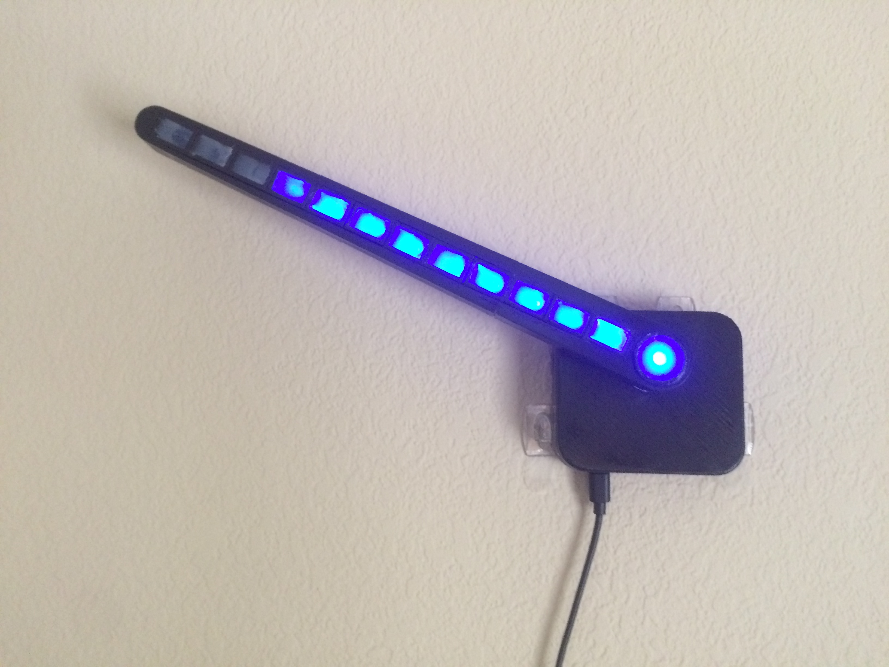

# LEDAnalogClock
Project by Matthew Chamot

* Code and CAD files for an analog/digital clock.  
* The angle of the clock hand shows the hours and the number of lit LEDs shows the minutes.
* In the image below the time is 10:45.

{:height="36px" width="36px"}

Sometimes in the middle of the night, it is hard to easily see the time.  This clock acts as a night light and is also easy to read, even if your eyes are still a little sleepy.  

#### Description
The housing for the clock was custom designed and 3d printed to nicely enclose the electronics.  The microprosser used was a Teensy 3.2 with the crystal attached for time accuracy.  The minutes are displayed by the number of LEDs lit along the arm.  One LED for every 5 minutes.  On every hour, the servo rotates the hand to the correect position and after 24 hours the servo rotates the hand in reverse for two full revolutions so that the wires inside do not get too twisted.  A unique worm gear design prevents the weight of the arm from back-driving the servo and allows the servo to be off until it is needed every hour.
